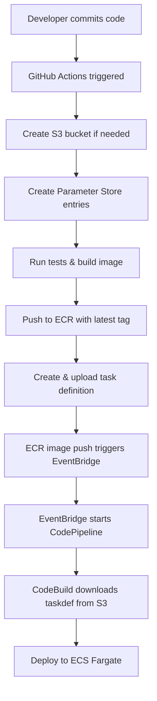

# Todo Application - Event-Driven Deployment

This repository contains the containerized Todo application built with Spring Boot, designed with an event-driven CI/CD pipeline that automatically deploys to ECS when Docker images are pushed to ECR.

## Architecture

- **Backend**: Spring Boot 3.2 with Java 17
- **Frontend**: HTML5, CSS3, Vanilla JavaScript
- **Database**: Amazon DynamoDB
- **Container**: Docker with multi-stage build
- **Deployment**: Event-driven via ECR → EventBridge → CodePipeline
- **CI/CD**: GitHub Actions → ECR → Automatic ECS deployment

## Features

### ✅ **Application Features**
- **Simple Todo Management**: Create, update, delete, mark complete
- **Search Functionality**: Search todos by title
- **Timestamps**: Created and updated timestamps displayed
- **Clean Interface**: Minimal, responsive design
- **Real-time Updates**: Immediate UI feedback

### ✅ **Technical Features**
- **Event-Driven Deployment**: ECR image push triggers automatic deployment
- **Self-Provisioning**: Creates S3 bucket and Parameter Store entries automatically
- **VPC Endpoints**: Cost-optimized deployment without NAT gateways
- **Parameter Store**: Centralized configuration management
- **Health Checks**: Application and container health monitoring

## API Endpoints

### Todo Management
```
GET    /api/todos              # Get all todos
POST   /api/todos              # Create a new todo  
GET    /api/todos/{id}          # Get specific todo
PUT    /api/todos/{id}          # Update specific todo
DELETE /api/todos/{id}          # Delete specific todo
PATCH  /api/todos/{id}/toggle   # Toggle completion status
```

### Search and Statistics
```
GET    /api/todos/status/{completed}     # Get todos by status
GET    /api/todos/search?q={searchTerm}  # Search todos by title
GET    /api/todos/stats                  # Get todo statistics
DELETE /api/todos                        # Delete all todos
```

### Health and Monitoring
```
GET    /health                  # Application health check
GET    /actuator/health         # Spring Boot health endpoint
GET    /actuator/metrics        # Application metrics
```

## Event-Driven Deployment Flow



## GitHub Actions Workflow

The workflow automatically:

### ✅ **Resource Provisioning**
- Creates S3 bucket: `todoapp-deployment-artifacts-{AccountId}`
- Creates Parameter Store entries:
  - `/TodoApp/deployment/s3-bucket`
  - `/TodoApp/deployment/ecr-repository` (only if doesn't exist)

### ✅ **Build & Test**
- Runs Maven tests
- Builds Docker image
- Pushes to ECR with commit SHA and `latest` tags

### ✅ **Deployment Preparation**
- Creates task definition with new image URI
- Uploads `taskdef-{commit}.zip` to S3 bucket
- ECR image push triggers EventBridge → CodePipeline → ECS deployment

## Local Development

### Prerequisites
- Java 17 or later
- Docker
- Maven (or use included wrapper)
- AWS CLI (for Parameter Store and S3 access)

### Running Locally
```bash
# Clone the repository
git clone <repository-url>
cd todo-application

# Run with Maven
./mvnw spring-boot:run

# Or build and run with Docker
docker build -t todo-app .
docker run -p 8080:8080 todo-app
```

### Environment Variables
```bash
AWS_REGION=us-east-1                    # AWS region
DYNAMODB_TABLE_NAME=TodoTable           # DynamoDB table name
AWS_DYNAMODB_ENDPOINT=                  # For local DynamoDB (optional)
SPRING_PROFILES_ACTIVE=development      # Spring profile
```

## GitHub Repository Setup

### Required Secrets
```bash
AWS_ACCESS_KEY_ID       # AWS access key for deployment
AWS_SECRET_ACCESS_KEY   # AWS secret key for deployment
AWS_ACCOUNT_ID          # AWS account ID for S3 bucket naming
```

### Required Permissions
The AWS credentials need these permissions:
- **ECR**: Full access for image push/pull
- **S3**: Create bucket, put/get objects
- **SSM Parameter Store**: Create and read parameters
- **ECS**: Read task definitions (for task definition creation)

### Automatic Triggers
The workflow triggers on:
- Push to `main` branch
- Changes to: `src/**`, `pom.xml`, `Dockerfile`, `.github/workflows/**`
- Manual workflow dispatch

## Configuration

### Todo Model (Simplified)
```java
public class Todo {
    private String id;           // UUID
    private String title;        // Max 200 characters
    private boolean completed;   // Completion status
    private Instant createdAt;   // Creation timestamp
    private Instant updatedAt;   // Last update timestamp
}
```

### DynamoDB Schema
```yaml
Table: TodoTable
Partition Key: id (String)
Attributes:
  - id: String (UUID)
  - title: String
  - completed: Boolean
  - createdAt: String (ISO instant)
  - updatedAt: String (ISO instant)
```

## Parameter Store Integration

The application workflow creates and uses these Parameter Store entries:

| Parameter | Description | Usage |
|-----------|-------------|-------|
| `/TodoApp/deployment/s3-bucket` | S3 bucket for artifacts | Always updated |
| `/TodoApp/deployment/ecr-repository` | ECR repository URI | Created if missing |

### Parameter Store Benefits
- **Centralized Configuration**: Single source of truth
- **Cross-Stack References**: VPC infrastructure reads these values
- **Dynamic Updates**: S3 bucket name stays current
- **Preserved Settings**: ECR repository won't be overwritten if manually configured

## Docker Configuration

### Multi-stage Dockerfile
```dockerfile
# Build stage with Maven
FROM maven:3.9-openjdk-17 AS build
COPY . .
RUN mvn clean package -DskipTests

# Runtime stage with minimal JRE
FROM openjdk:17-jre-slim
COPY --from=build target/*.jar app.jar
EXPOSE 8080
ENTRYPOINT ["java", "-jar", "/app.jar"]
```

### Build Optimization
- **Multi-stage build**: Smaller production image
- **Layer caching**: Dependencies cached separately
- **Security scanning**: Automated vulnerability checks
- **Health checks**: Built-in container health monitoring

## Monitoring and Logging

### Application Monitoring
- **Health Endpoint**: `/health` for load balancer checks
- **Actuator Metrics**: `/actuator/health` and `/actuator/metrics`
- **Custom Metrics**: Todo operation counters

### Infrastructure Monitoring
- **CloudWatch Logs**: Application logs in `/ecs/TodoApp` log group
- **ECS Metrics**: Task CPU, memory, and network usage
- **ALB Metrics**: Request count, latency, error rates

### Event Monitoring
- **ECR Events**: Image push notifications
- **CodePipeline**: Deployment success/failure
- **EventBridge**: Rule execution and errors

## Troubleshooting

### Build Failures
```bash
# Check GitHub Actions logs
# Common issues:
# 1. AWS credentials expired
# 2. Maven test failures
# 3. Docker build errors
```

### Deployment Issues
```bash
# Check Parameter Store entries exist
aws ssm get-parameter --name "/TodoApp/deployment/s3-bucket"
aws ssm get-parameter --name "/TodoApp/deployment/ecr-repository"

# Verify S3 bucket and task definition
aws s3 ls s3://todoapp-deployment-artifacts-{AccountId}/taskdefs/

# Check ECR repository
aws ecr describe-repositories --repository-names todo-app
```

### EventBridge Not Triggering
1. Confirm image pushed with `latest` tag
2. Check EventBridge rule is enabled
3. Verify ECR repository name matches (`todo-app`)
4. Review EventBridge rule metrics

## Performance Optimization

### Application Tuning
```yaml
# application.yml
spring:
  datasource:
    hikari:
      maximum-pool-size: 10
server:
  tomcat:
    threads:
      max: 200
```

### Container Optimization
```bash
# JVM tuning for containers
ENV JAVA_OPTS="-Xmx512m -Xms256m -XX:+UseG1GC"
```

## Security

### Application Security
- ✅ **Input Validation**: Title length and content validation
- ✅ **CORS Configuration**: Controlled API access
- ✅ **No Secrets**: Credentials via AWS IAM roles only
- ✅ **Health Checks**: Prevent unhealthy deployments

### Deployment Security
- ✅ **Private Deployment**: All infrastructure in private subnets
- ✅ **VPC Endpoints**: No internet access required
- ✅ **IAM Roles**: Minimal required permissions
- ✅ **Parameter Store**: Encrypted configuration storage

## Cost Analysis

### GitHub Actions (Free Tier)
- ✅ **2000 minutes/month**: Sufficient for most workflows
- ✅ **500MB storage**: GitHub Packages storage

### AWS Resources (Created by Application)
- **S3 Bucket**: <$1/month (task definitions)
- **Parameter Store**: Free (standard parameters)
- **ECR Repository**: $0.10/GB/month (images)

## Development Workflow

### Feature Development
1. Create feature branch from `main`
2. Develop and test locally
3. Push to feature branch (no deployment)
4. Create pull request
5. Merge to `main` triggers automatic deployment

### Deployment Process
1. **Code pushed to main** → GitHub Actions starts
2. **Tests pass** → Docker image built and pushed
3. **ECR image push** → EventBridge rule triggers
4. **CodePipeline starts** → Downloads latest task definition
5. **ECS deployment** → Zero-downtime rolling update

### Rollback Process
1. **Automatic**: ECS health checks trigger rollback on failure
2. **Manual**: Deploy previous task definition from S3
3. **Emergency**: Scale to previous image version manually

## Contributing

1. Fork the repository
2. Create a feature branch
3. Make your changes with tests
4. Update documentation as needed
5. Submit a pull request

### Code Standards
- ✅ **Java Formatting**: Follow Google Java style
- ✅ **Test Coverage**: Maintain >80% coverage
- ✅ **API Documentation**: Update README for API changes
- ✅ **Docker Security**: Keep base images updated